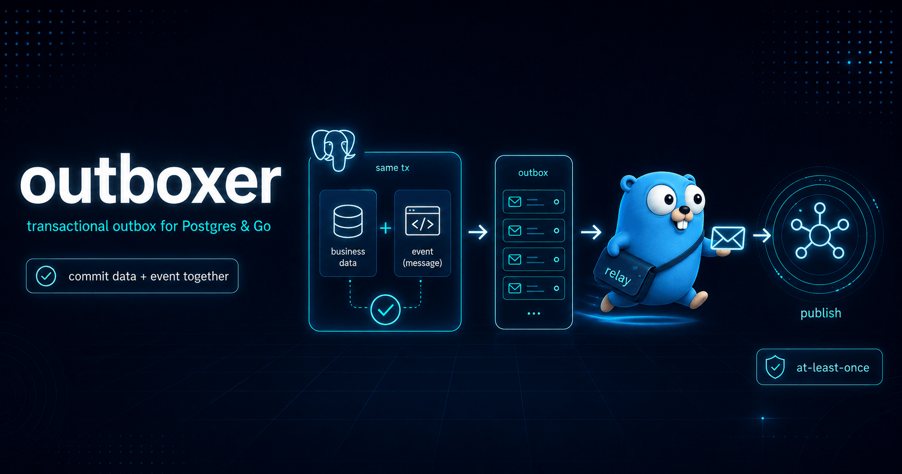

# outboxer

[](https://github.com/gokern/outboxer/actions/workflows/ci.yml)
[](https://github.com/gokern/outboxer/actions/workflows/lint.yml)
[](https://github.com/gokern/outboxer/actions/workflows/codeql.yml)
[](https://pkg.go.dev/github.com/gokern/outboxer)
[](go.mod)
[](https://github.com/gokern/outboxer/releases)
[](LICENSE)

<p align="center">
  
</p>

A transactional outbox for Postgres and Go. Write events to a table inside the same
transaction as your business data; a relay claims them and hands each to your publish
function, at-least-once, safely across replicas. Depends on `pgx`, and on
[`gokern/panics`](https://github.com/gokern/panics), which has none of its own.

```go
// Producer: built once at wiring time, then the row and the business data
// commit together because they go through the same handle.
producer, err := outboxer.NewProducer()

tx, _ := pool.Begin(ctx)
createUser(ctx, tx, user)
producer.Insert(ctx, tx, outboxer.Message{
    Topic:   "user.created",
    Payload: data,
})
tx.Commit(ctx)

// Relay, in its own binary or its own goroutine.
relay, err := outboxer.NewRelay(pool, publish)
err = relay.Run(ctx)
```

Wiring you can copy is in [`example_test.go`](example_test.go) and on pkg.go.dev. The rest
of this file is the contract and the behaviour worth knowing before wiring it in.

## Requirements

Requires Go 1.26+ and PostgreSQL 14 through 18.

That Postgres range is what CI runs the whole suite against on every commit, not what the
SQL looks like it ought to support. Nothing here inspects the server version, so a range no
job executes would be a promise nobody could discover was broken.

## The two sides

Two constructors, one per direction, and each validates everything it was given before it
returns. Nothing configurable is left to be discovered on the path that moves rows. A third,
`NewSampler`, reads the table's state rather than moving anything through it; see
**Observability**.

`NewProducer` builds the write side. `Producer.Insert` takes the Postgres handle **per
call**, so the transaction-manager seam is the call site itself: pass a transaction and the
write is atomic with your data, pass the pool and it commits on its own. Both are
legitimate; the producer holds no connection and never decides for you.

`NewRelay` builds the read side over a pool, and `Run` drains it until its context is
cancelled. The two sides do not have to share a process, and a producer that only writes
never opens a LISTEN connection.

All three name their table with `WithTable`, which defaults to `outbox`. That name is the
one fact they have to agree on, so it is also the only option every constructor accepts.
Every other setting belongs to the relay, and the compiler refuses it on `NewProducer` and
`NewSampler` alike.

## Delivery semantics

**At-least-once.** A publish can succeed and the mark that follows can fail, and the row is
then redelivered. Consumers must be idempotent: use `Delivery.ID` as the broker's dedupe
key.

**No ordering.** Rows are claimed with `FOR UPDATE SKIP LOCKED`, so concurrent workers and
replicas are safe but unordered.

Two different paths produce a duplicate, and it is worth knowing which is which. A mark that
fails after a successful publish is fatal, so the process exits and the row falls due again
at lease expiry. That gap is bounded by `Lease`, and it is the one a broker's dedupe window
has to cover. A publish whose acknowledgement is lost after the server stored it looks like
a plain failure from here, so it goes through `RetryFunc` instead, and that gap is bounded
by your own policy. The second path is why `RetryFunc` carries no cap: capping every
caller's policy to narrow a window idempotency already covers is the wrong trade.

## Schema

Your application owns the table and its migrations; this package never runs one.
[`migration/0001_create_outbox.up.sql`](migration/0001_create_outbox.up.sql) is the
reference DDL, meant to be copied into your own history. It is deliberately plain: no
`IF NOT EXISTS` guards, because a guard turns a mis-ordered migration into a silent
success, and no lock strategy either way, because that policy is yours.

One thing that policy has to account for here. A later migration that holds
`ACCESS EXCLUSIVE` on this table for more than five seconds while a relay is running
produces a duplicate delivery. The relay publishes a row and then marks it; the mark blocks
on the lock and gives up at the internal five-second bound, and the row, already at the
broker, comes back at lease expiry and goes out again. `ALTER TABLE`, a non-concurrent
`CREATE INDEX`, `VACUUM FULL`, `REINDEX` and `CLUSTER` all take that lock. It is a duplicate
and never a loss, so an idempotent consumer absorbs it; to avoid it anyway, stop the relays
for the migration or use the `CONCURRENTLY` forms.

A `statement_timeout` on the relay's role is the same trap by another route. Set below that
five-second bound it turns any mark the server holds up into the same duplicate, so keep it
comfortably above, or leave it unset on that role. Set below what a claim over a large
backlog takes, it stops the relay outright with `SQLSTATE 57014`, which at least says so.

| Column | Type | Meaning |
|---|---|---|
| `id` | `BIGINT` identity | row identity; the broker dedupe key |
| `topic` | `TEXT` | routing, carried verbatim |
| `payload` | `BYTEA` | opaque bytes, carried verbatim |
| `headers` | `JSONB` | optional metadata; a flat object of strings |
| `attempts` | `INT` | incremented **by the claim** |
| `created_at` | `TIMESTAMPTZ` | row age, on the database clock |
| `ready_at` | `TIMESTAMPTZ` | when the row is next due |
| `published_at` | `TIMESTAMPTZ` | `NULL` means pending |

Extra columns (tenant ids, partition keys) are fine and never touched.

Three things beyond the table itself, in order of how much you need them:

- **`outbox_due_idx`**, a partial index on `(ready_at, id) WHERE published_at IS NULL`.
  Without it every claim is a sequential scan. The ordering leads with `ready_at` rather
  than `id`, which lets the claim seek straight past deferred rows instead of walking them
  and throwing each one away. Deferral is ordinary traffic here: a broker outage defers the
  whole backlog at once, and `Message.Delay` defers by design.

  Adding `INCLUDE (created_at, attempts)` to it is tempting and mostly is not worth it. At a
  moderate backlog beside many published rows it turns the bitmap heap scan into an
  index-only scan and saves a fraction of a millisecond, which is where the read was already
  cheap. In the case that hurts it does nothing: at a large backlog the planner takes the
  sequential scan anyway, and forcing the index-only scan instead measured half again
  slower. An index-only scan wants an all-visible heap, and a live outbox never has one,
  because every claim updates the pending rows it would otherwise skip reading. Weigh that
  against a heavier write path.
- **The `AFTER INSERT` trigger** calling `pg_notify` on the channel. Without it the relay
  polls, which is correct everywhere and slower only where latency is measured in tens of
  milliseconds. The channel name is the table name.
- **`outbox_published_idx`**, only if you turn retention on.

### Keep the two clocks close

`ready_at` and `created_at` are stamped by the database, while `Message.Delay` and every
timeout you configure are measured by your process. The relay compares the two, with a floor
so that skew can never turn a wait into a spin. But a client running ahead of the server by
more than the shortest `Delay` you use will poll harder than it needs to for as long as the
skew lasts. Ordinary NTP is enough; a suspended VM or an unsynchronised container is not.

`ready_at` carries one meaning: when the row is next due. The claim sets it to
`now + lease`, a failed publish sets it to `now + RetryFunc(...)`, and a producer sets it
forward through `Message.Delay`. A scheduled event therefore falls out of the same column
that implements the lease.

`attempts` is incremented by the claim, in the same statement, and never by the failure
path. Counting only publish failures is blind to the failure that matters most: a row that
kills the process before the failure path runs is reclaimed at lease expiry with its
counter unchanged, so a poison row loops forever at zero. Claiming is attempting.
`Delivery.Attempt` is therefore honest, and `PublishFunc` may refuse a row whose count has
gone absurd. That policy belongs to you, not here.

### Headers must be a flat JSON object of strings

That is the only shape `map[string]string` can hold. The write side always produces one:
`nil` becomes `{}` and never `NULL`, and a key or value that is not valid UTF-8 is refused
instead of letting `json.Marshal` quietly replace the bytes with U+FFFD. A row written by
hand that carries something else (`{"n":1}`, an array, a nested object) is **skipped and
reported through `Observer.Warned`**, neither delivered nor fatal: the rows around it go
out, and it keeps its lease, so it comes back and is reported again instead of disappearing.
`NULL` headers arrive as `nil`.

### Keeping the schema correct is yours, and there is no `Check` method

This package never inspects the table. A missing table or column is the one thing it hears
about, because Postgres raises it on the first statement that touches the table. It arrives
as `ErrSchemaMismatch`, and nothing else does.

Everything past that is silent and stays silent. Drop `outbox_due_idx` and every claim
becomes a sequential scan that grows with the table. Drop the trigger, rename the channel,
or let the LISTEN session go through a transaction-pooling pooler, and the relay stays
correct but never gets a push wake-up and finds work only on its poll tick.

Those are real failures, and they belong to the migration review and to whatever already
watches your database. A library cannot see them without guessing. The only answer available
to it is a string match against catalogue internals: `indpred` containing
`published_at IS NULL`, `prosrc` containing `pg_notify(...)`. That calls any schema meeting
the contract by other means broken, and a wrong answer given confidently is worse than none.

## Configuration

Every option returns an error. Nothing is clamped and nothing is ignored, so what you
declared and what runs are the same thing. That is also why there is no `Config` type to
read values back from: you already hold them.

| Option | Default | Bounds |
|---|---|---|
| `WithTable` | `outbox` | the table every constructor names; the **only** one `NewProducer` and `NewSampler` accept |
| `WithMaxConcurrency` | 16 | publishes in flight at once; a ceiling, not a steady count |
| `WithLease` | 60s | how long a claimed row stays undue |
| `WithPublishTimeout` | 5s | one `PublishFunc` call |
| `WithPollInterval` | 10s | how long the wait blocks without a notification |
| `WithRetention` | 0 (off) | age at which a published row is deleted; a floor, not an exact age |
| `WithPruneInterval` | 1h, or the retention window when shorter | how often retention sweeps; needs `WithRetention`, and refused if longer than the window |
| `WithRetry` | one lease | when a failed row becomes due again |
| `WithDialer` | none (poll-only) | how to open the dedicated LISTEN session |
| `WithObserver` | none | everything the relay reports |

**No default is exported.** A caller who needs to compute with an interval, a liveness
window say, should declare that interval and compute from what they declared. A number
inherited from this package changes silently when this package changes its mind.

`NewRelay` refuses a lease that does not exceed the publish timeout plus an internal 5s mark
bound, because a shorter one lets a second replica reclaim a row the first is still
publishing. The error names all three durations, so a legal lease can be computed from it
without knowing the constant.

A `PollInterval` at or above `Lease` is *reported*, not refused. A longer poll delays the
reclaim of a crashed replica's row, which is slower but not wrong.

Size the pool to `MaxConcurrency` plus your own headroom. The listener holds one extra
connection that does not come from the pool.

### Behind a transaction-pooling pooler

PgBouncer and friends: the claim, mark, defer, prune and insert paths all work, whether pgx
prepares its statements or runs in `exec` mode where no parameter's column type is ever
resolved. That is verified against a real PgBouncer in transaction mode and not only
simulated; `make test-pgbouncer` runs it against yours. If your pooler predates PgBouncer
1.21 it cannot route prepared statements at all, and pgx has to be put in `exec` mode for
reasons that have nothing to do with this package.

The LISTEN session must not go through one, and the failure is silent. `LISTEN` is accepted,
so the dial succeeds and `Observer.ListenerChanged` never fires. The pooler then hands the
server connection back and drops every notification that arrives while no client holds it.
What is left is a relay that is correct, polling, and indistinguishable from one that is
working. That behaviour was measured against a real pooler, and it is why `WithDialer`
exists instead of a DSN option: derive that connection from the pool's own DSN and it is
right until the day somebody puts a pooler in front of it.

`Run` owns the connection its `DialFunc` returns. It closes that connection on exit and
re-dials after a break, so the function must return a fresh connection every time, never a
shared handle.

## What stops the relay

- **A publish failure is never fatal.** The row is deferred by `RetryFunc` and reported
  through `Observer.Published`. The deferral is written *before* the observer runs, so a slow
  observer cannot sit between a failure and the recording of its consequence.
- **A `PublishFunc` that panics is a publish failure, not a crash.** The panic is recovered
  and reaches you through both `RetryFunc` and `Observer.Published`: `panics.Is(err)` reports
  it, and `panics.As(err)` gives you the value it was raised with and the frames it came
  from. It is contained for the same reason skipping a row with undecodable headers does not
  stop the relay: one message must not stop every other one. Uncontained, it would abandon
  every delivery in flight beside it, including rows already published and about to be
  marked, each of which returns at lease expiry as a duplicate. The same row would then meet
  the same bug after every restart. Match on it if a row that panics deserves a policy of its
  own; it will very likely panic again. The test is a broad one: it holds for a panic
  contained anywhere, including one your own code recovered and reported as an ordinary
  error, which the relay cannot tell apart from a panic of its own making.
- **Every other function you supply is contained too.** A `RetryFunc`, a `DialFunc` and every
  `Observer` field run on the relay's goroutines, and a panic in one of those is an advisory
  rather than the delivery's own error: it reaches `Observer.Warned`, and a `DialFunc`'s
  reaches `Observer.ListenerChanged`.
- **A storage failure on the claim is fatal.** `Run` returns it. Nothing was claimed and
  nothing was published, so the cost is delay and not correctness. The relay stops anyway,
  because how long an unreachable database is worth waiting for is your policy and not this
  package's. A dropped connection is the ordinary cause and is not exotic: a failover, a
  pooler restart and an administrator's `pg_terminate_backend` all produce one, and it
  clears by itself once the pool has cycled out its dead connections. See **Supervision**
  below, since `Run` is single-use and carrying on is not a matter of calling it again.
- **A storage failure on the mark is fatal.** The row was published and the database does
  not know, so the duplicate is already guaranteed. The only thing left to control is that
  it is one duplicate and not a stream. The relay is stopped *before* `Observer.Published` is
  told, because every row published during that call would be another the database does not
  know about.
- **A claim that failed because the context was cancelled is shutdown, not failure.**
  Without that carve-out every clean deploy reports itself as a crash.
- **Housekeeping is never fatal.** A failed retention sweep is reported through
  `Observer.Pruned` and nothing else.
- **A wedged relay stops itself.** A `PublishFunc` that ignores its context never returns
  and nothing in Go can make it, so once every slot is occupied for twice as long as one
  delivery may legally take, `Run` returns `ErrPublishStalled`. Restarting the process is
  the only recovery, and only you can do that: the goroutines holding those slots outlive
  `Run`.
- **A shutdown that gave up waiting is returned, not whispered.** Cancellation waits for the
  in-flight publishes on a context detached from it, so a row already claimed finishes its
  publish and its mark, and that wait is itself bounded so a publisher ignoring its deadline
  cannot hang your task group. `Run` returns nil only when those publishes actually
  finished, and `ErrShutdownIncomplete` when the wait expired instead. They are still
  running detached and will mark themselves if the process lives, so exiting on that error
  is what turns it into duplicates.

There is no circuit breaker. How many consecutive failures mean "stop" is policy: you see
every failure through `Observer.Published` and cancel the context you passed to `Run`.

### Supervision

`Run` is single-use, and a second call returns `ErrAlreadyRun`. Keeping the outbox draining
across a failover therefore means building another `Relay`, not calling `Run` again.
[`ExampleRelay_Run`](example_test.go) is that loop. Two errors are the exception and should
end the process instead: after `ErrPublishStalled` and `ErrShutdownIncomplete` the publisher
goroutines are still running and still holding pool connections, so rebuilding in a loop
leaks another set of them on every pass.

## Observability

The package has no logger and no metrics of its own. Two things report, and they fail in
opposite directions: `Observer` runs inside the relay and stops when it does, while
`Sampler` reads the table and keeps answering when no relay is running at all.

### Observer

Every field is optional.

| Field | Fires |
|---|---|
| `Published` | after every publish attempt, successful or not |
| `Woke` | every time the relay stops waiting; the idle heartbeat |
| `ListenerChanged` | once per LISTEN connection transition; `nil` means recovered |
| `Pruned` | after each retention sweep, with the row count |
| `Warned` | non-fatal advisories: a poll interval at or above the lease, a clamped negative retry, a row whose headers could not be decoded, a deferral the database refused, a failed read of when the next row falls due, a callback of yours that panicked |

`Published` is one field on purpose. Splitting success from failure would lose the caller who
answers both with the same signal, a liveness probe for instance, since a relay that cannot
reach the broker is failing but not wedged.

All of them run on the relay's own goroutines. Hand work off instead of blocking in one.

### Sampler, and the same reading in SQL

Four numbers about the table, read on demand:

```go
sampler, err := outboxer.NewSampler(pool, outboxer.WithTable("outbox"))
stats, err := sampler.Stats(ctx) // Pending, Due, OldestAge, PeakAttempts
```

The same four numbers in SQL, for the monitoring that owns the database rather than the
process — a `postgres_exporter` custom query, a Datadog check, a psql session during an
incident:

```sql
SELECT count(*) AS pending,
       count(*) FILTER (WHERE ready_at <= statement_timestamp()) AS due,
       coalesce(extract(epoch FROM statement_timestamp() - min(created_at)), 0) AS oldest_age_seconds,
       coalesce(max(attempts), 0) AS peak_attempts
  FROM outbox
 WHERE published_at IS NULL;
```

`statement_timestamp()` and not `now()`, which is transaction-start time. Run inside a
transaction your exporter happened to open, `now()` misses every row that fell due since it
began, and reports a negative age for a row written since — a claimable row reads as
`due` = 0, and the age comes back as minus however long the transaction has been open.

Count `pending` and `due` separately or the numbers mislead. `pending` includes rows
deferred by `Message.Delay` and rows under lease right now, so it tracks load; `due` is what
should have gone out and did not.

**No single field is the alert.** They discriminate failures together:

| Failure | `Due` | `OldestAge` | `PeakAttempts` | `Pending` |
|---|---|---|---|---|
| relay dead or wedged | grows | grows | **frozen** | grows |
| relay too small for the traffic | grows | grows slowly | low | grows |
| broker down | ≈0, oscillating | grows | **climbing** | grows |
| one poison row | ≈0 | grows | climbing on one row | flat |

`Due` reads near zero during a broker outage because the relay keeps claiming: each failing
row is due for an instant, then deferred by `RetryFunc` for a whole lease. `PeakAttempts`
frozen against climbing is what separates a dead relay from a dead broker, because the claim
counts the attempt as it takes the lease.

`OldestAge` has one caveat by construction: a row scheduled far ahead with `Message.Delay`
counts from when it was written, so a service that schedules days out carries a permanently
large age and should alert on `Due` and `PeakAttempts` instead. Excluding those rows is
impossible — deferred, leased and retried rows are indistinguishable in the schema.

**Scrape on the order of tens of seconds, never per request.** While the backlog is small
`Stats` seeks the partial index and never reads a published row, so it costs microseconds
however many published rows have accumulated. Once the pending rows are a large fraction of
the table the planner switches to a sequential scan, which reads the published rows too, and
the read grows by two to three orders of magnitude. The cost stops tracking the backlog and
starts tracking the table, precisely when the backlog is worst.

### Metrics

Every metric worth having comes from `Observer` and `Sampler`, and the package ships none of
them, because names and labels are your organisation's conventions.
[`outboxprom`](outboxprom) picks one set and exports it, in a module of its own so
`client_golang` never reaches this `go.mod`:

```go
metrics, err := outboxprom.NewMetrics()
relay, err := outboxer.NewRelay(pool, publish, outboxer.WithObserver(metrics.Observer()))

sampler, err := outboxer.NewSampler(pool)
backlog, err := outboxprom.NewBacklog(sampler)

prometheus.MustRegister(metrics, backlog)
```

Five options cover what the defaults do not: `WithNamespace` for the metric prefix,
`WithConstLabels` for a shard or tenant, `WithoutTopicLabel` when topics are unbounded,
`WithLagBuckets` for your own SLO, and `WithSampleTimeout` to bound the scrape's query.

Wiring your own instead is a table lookup:

| Metric | Where it comes from |
|---|---|
| publishes by topic and outcome | `Observer.Published`, `err == nil` |
| publish duration | wrap your own `PublishFunc`; the package is not involved |
| insert-to-publish lag | `time.Since(delivery.CreatedAt)` in `Published`, on success only |
| attempt distribution | `delivery.Attempt` |
| listener up/down | `Observer.ListenerChanged`; the degrade is otherwise silent |
| retention volume and failures | `Observer.Pruned` |
| advisories by class | `Observer.Warned` with `errors.Is` — never by message text |
| backlog, age, worst attempt count | `Sampler.Stats` |

Two things to get right whichever way you export them:

- **Cardinality.** `Topic` is a label only if your topics are a bounded set. Never label by
  `Delivery.ID`, a key, or an error's text.
- **Replicas.** Every replica reports the same table, so aggregate the backlog with
  `max by`, never `sum`, or it gets multiplied by the replica count.

## What this package deliberately does not do

Each of these is withheld on purpose, not missing.

| It does not | Why, and whose job it is |
|---|---|
| **Open a transaction** | `Execer` is one method, `Exec`: there is no `Begin` to call, so the write side cannot. The relay holds a `*pgxpool.Pool` and is held to it by discipline instead. Every statement it issues is a single statement, which is how the claim takes a lease and counts an attempt indivisibly. Atomicity is whatever the handle you pass to `Producer.Insert` provides, and rollback belongs to whoever opened the transaction. |
| **Open a connection** | The pool and the LISTEN session are yours: your DSN, your TLS, your custom types, your `AfterConnect`. `WithDialer` takes a function rather than a connection because that session is re-dialled after every drop. |
| **Run a migration, or inspect the schema** | The table, its indexes, the NOTIFY trigger and the channel name are yours to create and keep correct. A missing table or column comes back as `ErrSchemaMismatch` on the first statement; a missing index or trigger is silent, and always will be. See **Schema**. |
| **Keep one table name across your two binaries** | `WithTable` defaults to `outbox` and both sides have to be given the same value. Declare it once in your own configuration and pass that to each. Where both tables exist a mismatch is invisible from in here, the same way a publisher and a subscriber on different subjects are invisible to a broker. |
| **Bound its own queries** | Only your context deadline bounds them, and the mark and the deferral run detached from cancellation on purpose. A `statement_timeout` in your `AfterConnect` bounds every query in your service, not only these. |
| **Interpret your payload or topic** | Bytes and a string, carried verbatim. Serialization, schema registry and routing conventions are yours. |
| **Guarantee order, or exactly-once** | Replicas are safe but unordered, and delivery is at-least-once; see **Delivery semantics**. |
| **Give up on a poison row** | It hands you `Delivery.Attempt` and never picks the threshold. Refusing a row whose count has gone absurd is your policy, inside `PublishFunc`. |
| **Log, or break a circuit** | Every outcome reaches you through `Observer`; stopping is cancelling the context you passed to `Run`. |
| **Export metrics from this module** | This `go.mod` keeps its one external dependency whatever you export them with. [`outboxprom`](outboxprom) does the exporting, as a module of its own: importing it is opt-in, and not importing it costs you nothing. |
| **Scrape itself** | `Sampler` has no ticker and starts no goroutine. It reads when you call it, so the cadence, the timeout and the registry belong to your scraper. |

## Development

Needs a Postgres the test suite may own outright, since it drops and recreates its tables on
every run.

```bash
make db               # a throwaway Postgres on port 15433
make test             # go test -race -shuffle=on
make lint
make test-outboxprom  # the outboxprom module; needs no database
make check            # lint, test, test-outboxprom, vuln
```

`make` on its own lists the targets. `make db` takes `DB_IMAGE` and `DB_PORT`, which is how
one leg of the CI matrix is reproduced locally:
`make db DB_IMAGE=postgres:14-alpine DB_PORT=15444`.

`outboxprom` is a module of its own, so nothing at the root reaches it: `go test
./...`, `go mod tidy` and `golangci-lint run` all stop at the module boundary, and CI runs
each of them a second time inside that directory. It shares this `.golangci.yaml`, which
golangci-lint finds by searching upwards; the few rules that differ for it are marked by path
there.

It depends on the root through a `replace` onto the working tree, so a change here is compiled
against the collectors that use it. Go ignores a dependency's own `replace`, though, so
**what an adopter compiles against is the `require` beside it** — and the replace is what
hides a wrong version there until somebody imports the module. That require is
a floor rather than a pin: it names the oldest root carrying what the module uses, and an
adopter who asks for a newer one gets the newer one, so it does not move with every release
here.

Nothing in this repository ever compiles the pair an adopter gets, and CI cannot: while a
change to both sides is unreleased, that pair is expected not to build. `make release-check`
compiles it in a copy with the replace dropped. Run it before tagging the module.

Module versions are tags of the form `outboxprom/vX.Y.Z`. The directory prefix is not
decoration — without it Go does not find the tag — and `v*.*.*` in `release.yml` does not
match it, so module versions get no GitHub release. The Releases page tracks the library.

The tests run shuffled and in parallel, here and in CI. Every test creates its own table,
named after itself, and the reference DDL names the NOTIFY channel after the table, so one
test's inserts can neither be seen by nor wake another's relay. They do still share one
database, which is why the order is shuffled: a test that leaves a trigger or a function
behind changes what the next one measures, and a fixed order hides that until somebody adds
a test.

The tests fail rather than skip without a database. That is deliberate: a suite that can go
green without one reports coverage it does not have, and the first thing to go unexecuted is
the replica safety that distinguishes this package from the alternatives, the one property
no unit test can stand in for.

The suite has two harnesses, because one shape cannot produce both properties it needs. The
temp-table one copies the migrated table `LIKE ... INCLUDING ALL` on a single pinned
connection: perfect isolation, and structurally incapable of row contention. The real-table
one creates a uniquely named table on a multi-connection pool, where contention between two
relays is the measurement.

## License

MIT.
